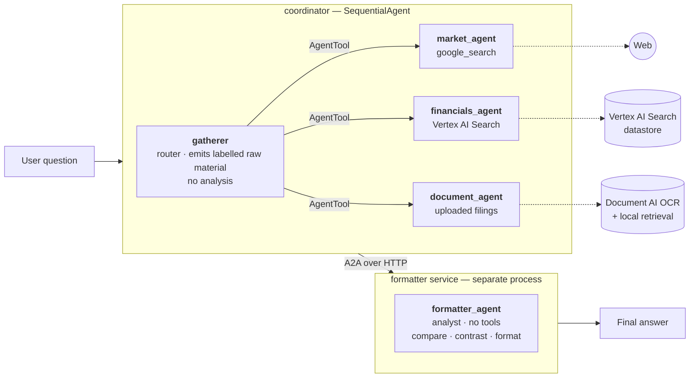

# Financial Research System

A multi-agent financial research system built on Google's Agent Development Kit (ADK). It answers questions about public companies by routing each question to the right specialist — a live web-search agent, a retrieval agent over a pre-indexed corpus of annual reports, or a document agent over filings you upload — then hands the gathered material to a **separate analyst service reached over A2A** that compares the sources and writes the final answer.

The document pipeline is real: PDFs go through **Google Document AI OCR**, and the extracted text is what gets indexed and searched. Not raw-PDF parsing.

> **Status:** the agent pipeline, the OCR pipeline, and all three deployment paths are working. The browser web app is in active development — see [Roadmap](#roadmap).

---

## Architecture



Two stages, deliberately split:

| Stage | Job | Why separate |
|---|---|---|
| **gatherer** | Decide which specialists a question needs, call them, emit their raw output verbatim in labelled sections | Routing and analysis are different skills. A router that also writes prose starts editing the evidence. |
| **formatter** | Compare and contrast the gathered material, add context, format the answer | Runs as its own A2A service — independently deployable and scalable, and it needs no cloud permissions because it has no tools. |

---

## Two things Gemini taught me the hard way

Both of these are load-bearing. The obvious design fails at runtime in ways that are not obvious from the docs.

### 1. You cannot mix a built-in search tool with any other tool

`google_search` and `VertexAiSearchTool` are Gemini **built-in** grounding tools. Gemini rejects any request whose tool list pairs a built-in with anything else — and two different built-ins cannot coexist either:

```
Multiple tools are supported only when they are all search tools
```

So the router cannot simply hold both search tools. Each built-in gets its **own isolated sub-agent**, exposed upward as an `AgentTool`. From the router's perspective those are ordinary function-call tools — two function calls, zero built-ins, which Gemini allows. That single constraint is why `market_agent` and `financials_agent` exist as separate agents rather than two tools on one agent.

### 2. Don't hand a large payload to a sub-agent as a tool argument

The intuitive way to reach the formatter is to wrap it as a third `AgentTool`. That fails. It forces the router's LLM to emit a function call whose argument is the *entire* gathered payload — a large multi-line string. Gemini 2.5 responds by slipping into code-style compositional calling:

```python
print(default_api.formatter_agent(request='''…thousands of characters…'''))
```

which the parser rejects as **`MALFORMED_FUNCTION_CALL`**, returning an empty answer.

The fix is to hand off through the **session** instead of through an argument: a `SequentialAgent` runs the gatherer, then the formatter, and `RemoteA2aAgent` forwards the text. The gatherer only ever emits plain text, so there is no oversized function call to mangle. Same logical flow, robust.

---

## The document pipeline

```
PDF  ──►  Document AI OCR  ──►  text  ──►  retrieval  ──►  Gemini  ──►  answer
          (chunked, parallel)              (two paths)      (analysis)
```

Conversion and analysis are separate concerns, and so is the retrieval step between them:

- **Uploaded documents** are OCR'd on the fly and answered from a lightweight in-process retriever. Instant — no indexing wait.
- **The standing corpus** lives in a **Vertex AI Search** datastore built from the same OCR output. Managed chunking, embedding and retrieval.

One correctness note worth stating, because it was a real bug: the datastore must be pointed at the **OCR text**, not the source PDFs. An earlier version indexed the bucket root — which held the raw PDFs — so retrieval silently ran on Vertex AI Search's own parser while the Document AI output sat unused in a subfolder. Pointing the datastore at the OCR text is what makes the pipeline actually use its own OCR.

`document_ai/extract.py` handles the conversion. Document AI's online endpoint caps at 15 pages per request, so larger filings are split with `pypdf`, processed chunk by chunk, and stitched back together.

---

## Quickstart

**Prerequisites:** a Google Cloud project with billing, `gcloud` installed, and Python 3.13.

```bash
# 1. Clone and create a virtualenv
git clone https://github.com/<you>/financial-research-system.git
cd financial-research-system
python -m venv adk_env
source adk_env/bin/activate          # Windows: adk_env\Scripts\activate

# 2. Install
pip install -r requirements.txt

# 3. Authenticate — ADC, not API keys
gcloud auth application-default login
gcloud auth application-default set-quota-project <your-project-id>

# 4. Enable the APIs
gcloud services enable \
  aiplatform.googleapis.com \
  documentai.googleapis.com \
  discoveryengine.googleapis.com

# 5. Configure
cp .env.example .env      # then fill in the values marked REQUIRED
```

Run it:

```bash
# Terminal 1 — the formatter A2A service
uvicorn formatter_agent.agent:a2a_app --host localhost --port 8001

# Terminal 2 — the coordinator
adk web
```

Open the URL it prints and pick **coordinator**.

### Authentication: ADC, not API keys

Everything runs on **Vertex AI** using Application Default Credentials. There is no API key anywhere in this repo, and that is deliberate:

- `VertexAiSearchTool` is Vertex-only — an AI Studio key cannot reach a Discovery Engine datastore at all.
- A public repo plus a live API key is a bad combination. ADC has nothing to leak.
- Cloud Run and GKE authenticate by service account, so the same code deploys without a secrets story.

One trap worth knowing: `gemini-flash-latest` is an **AI Studio alias** and returns 404 on Vertex. `ADK_MODEL` must be a real publisher model id such as `gemini-2.5-flash`.

---

## Building the indexed corpus

Optional — the system runs fine without it, and the lane disables itself cleanly if the datastore is unreachable.

```bash
# 1. Drop PDFs into document_ai/input_pdfs/, then OCR them
python document_ai/extract.py          # -> document_ai/output_text/*.txt

# 2. Upload the TEXT (not the PDFs) to a bucket
gcloud storage cp document_ai/output_text/*.txt gs://<your-bucket>/ocr_text/

# 3. Create a Vertex AI Search datastore pointed at gs://<your-bucket>/ocr_text/
#    (AI Applications console -> Data Stores -> Create -> Cloud Storage,
#     unstructured documents, location: global)

# 4. Put its id in .env
#    VERTEX_SEARCH_DATASTORE=your-datastore-id
```

Give the datastore a **deterministic id** when you create it. Console-generated ids carry a random suffix, which means every rebuild forces a config change.

Source filings are not included in this repo — get your own from [SEC EDGAR](https://www.sec.gov/edgar/searchedgar/companysearch).

---

## Project layout

```
coordinator/              the routing/gathering agent + its specialists
  agent.py                SequentialAgent(gatherer -> remote formatter)
  config.py               environment configuration
  sub_agents/
    market_agent.py       google_search        (live market data)
    financials_agent.py   VertexAiSearchTool   (indexed filings)
formatter_agent/          standalone A2A analyst service
  agent.py                to_a2a() -> Starlette app served by uvicorn
  prompt.py               the analyst instruction (canonical copy)
document_ai/
  extract.py              PDF -> Document AI OCR -> text
k8s/                      GKE deployment: one command up, one command down
```

**Why `coordinator/` and `formatter_agent/` each carry their own `config.py`:** they are deployed independently (`adk deploy agent_engine ./coordinator`, `gcloud run deploy --source ./formatter_agent`), so neither can import a shared module from the repo root. The duplication is the price of keeping each unit self-contained.

---

## Deployment

Three paths, all working:

| Target | Command | Notes |
|---|---|---|
| **GKE** | `./k8s/rebuild.sh` | Creates the cluster, deploys both services, prints the public IP. `./k8s/teardown.sh` deletes everything billable. |
| **Cloud Run** | `gcloud run deploy` / `adk deploy cloud_run` | Scales to zero. Deploy the formatter first — the coordinator dials its agent card. |
| **Agent Engine** | `adk deploy agent_engine ./coordinator` | Managed, always-on. |

The runtime service account needs three roles — `roles/aiplatform.user`, `roles/discoveryengine.viewer`, and `roles/documentai.apiUser`. Each deployment target runs as a *different* service account, which is the single most common source of runtime 403s here.

---

## Roadmap

- [x] Multi-agent routing with isolated built-in search tools
- [x] Remote analyst over A2A, with graceful in-process fallback
- [x] Document AI OCR pipeline with page-accurate output
- [x] GKE / Cloud Run / Agent Engine deployment
- [ ] Browser web app: drag-and-drop upload, live agent-trace panel, streaming answers
- [ ] In-process retrieval over uploaded documents

---

## License

MIT — see [LICENSE](LICENSE).
