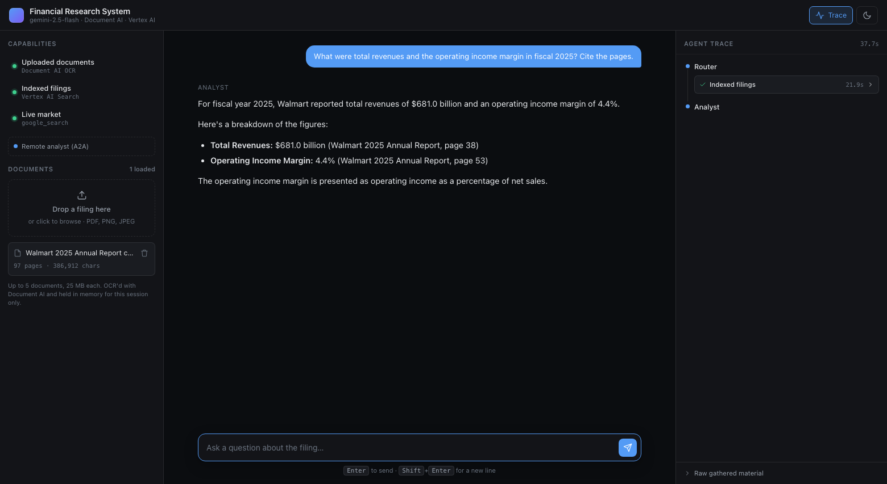
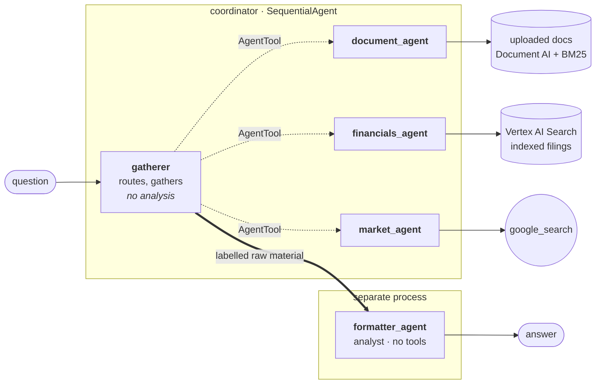

# Financial Research System

Upload a financial filing, ask questions about it, and watch the system decide
who should answer.

A multi-agent research tool built on Google's Agent Development Kit. Uploaded
PDFs are converted by **Google Document AI OCR**; questions are routed across the
specialists that are live — your uploaded documents, a pre-indexed corpus in
**Vertex AI Search**, and live web search — and the gathered material is handed to
a **separate analyst service reached over A2A**, which writes the final answer.



The right-hand panel is the point. A multi-agent system that hides its routing is
indistinguishable from one slow chatbot, so every decision is on screen: which
specialist was called, what it was asked, how long it took, and — behind a
disclosure — the exact labelled block the analyst received.

---

## Quickstart

Needs a Google Cloud project with billing, `gcloud`, and Python 3.13.

```bash
git clone https://github.com/yash735/financial-research-system.git
cd financial-research-system

python -m venv adk_env
./adk_env/bin/python -m pip install -r requirements.txt

gcloud auth application-default login
gcloud auth application-default set-quota-project <your-project-id>
gcloud services enable aiplatform.googleapis.com documentai.googleapis.com discoveryengine.googleapis.com

cp .env.example .env      # fill in the values marked REQUIRED
./run.sh                  # → http://127.0.0.1:8000
```

Drop a 10-K on the page and ask it something. A 97-page annual report OCRs in
about 15 seconds.

Full setup notes, including how to build the indexed corpus, are in
[docs/local-development.md](docs/local-development.md) and
[docs/data-pipeline.md](docs/data-pipeline.md).

---

## Architecture



Routing and analysis are split because they are different jobs — a router that
also writes prose starts editing the evidence on its way past. The analyst runs
as its own A2A service: independently deployable, and it needs no cloud
permissions at all because it has no tools.

Full detail in [docs/architecture.md](docs/architecture.md).

---

## What actually happens, step by step

### Part 1 — a PDF becomes searchable

```
   drag a PDF onto the page
            │
   1. POST /api/documents ─────────────────────────── webapp/api.py
            │  multipart, with the session id
            ▼
   2. validate ──────────────────────────────────────  webapp/ingest.py
            │  magic bytes (%PDF-, not the filename or content-type header)
            │  size cap · per-session document cap
            ▼
   3. register + return 202 IMMEDIATELY ─────────────  coordinator/document_store.py
            │  uuid doc_id, status "processing", sha256 of the bytes
            │  the browser starts polling GET /api/documents once a second
            ▼
   4. OCR on a worker thread ────────────────────────  document_ai/ocr.py
            │
            ├─ cache hit on sha256?  →  .cache/ocr/<hash>.json  →  skip to 5
            │
            ├─ count_pages()                            pypdf, no network
            ├─ iter_page_chunks()                       split into <=15-page slices
            │                                           (Document AI's online limit)
            ├─ ThreadPoolExecutor, 4 workers            process_document() blocks,
            │                                           so chunks fan out in parallel
            │     each chunk → Document AI OCR processor, raw bytes, no GCS
            │
            ├─ per-page text                            slice document.text by each
            │                                           page's text_anchor offsets —
            │                                           this is what makes page
            │                                           citations possible later
            └─ progress callback → store.set_progress   drives the rail's progress bar
            ▼
   5. mark_ready() ──────────────────────────────────  coordinator/retrieval.py
            │  chunk_pages()   ~1200-char passages, never crossing a page
            │                  boundary, 200-char overlap
            │  Bm25Index.build()  tokenise, document frequencies
            ▼
      status "ready" — 97 pages in ~15s, or 0s on a cache hit
```

Nothing is written to disk except the OCR text cache. The uploaded bytes never
touch the filesystem.

### Part 2 — a question becomes an answer

```
   you type a question
            │
   1. POST /api/chat  (SSE stream) ─────────────────── webapp/api.py
            │  {session_id, message, mode}
            │  picks the normal or deep runner
            ▼
   2. build state_delta ─────────────────────────────  webapp/state.py
            │  uploaded_docs        a MANIFEST only (id, filename, pages)
            │  uploaded_docs_summary  "report.pdf (97 pages)"
            │  the document TEXT stays in the store — putting it in session
            │  state would serialise it into every event
            ▼
   ┌─ HOP 1 ─ gatherer ──────────────────────────────  coordinator/agent.py
   │        reads {uploaded_docs_summary?} in its instruction
   │        decides which specialists this question needs
   │        emits AgentTool calls — several in one turn run concurrently
   │        thinking OFF in both modes (it is a classification)
   └────────────────────────────────────────────────────────────┐
            ▼                                                    │
   ┌─ HOP 2 ─ specialist(s), in parallel ────────────────────────┤
   │                                                             │
   │  document_agent          coordinator/sub_agents/document_agent.py
   │    list_uploaded_documents()  reads THIS session's manifest
   │    search_documents(query)    validates the doc_id against that
   │                               manifest, then BM25 over the passages,
   │                               boosting fiscal-year and numeric terms
   │    read_document(...)         capped at 24k chars per call
   │    → excerpts with (filename, p. N)
   │                                                             │
   │  financials_agent   → VertexAiSearchTool over the datastore  │
   │  market_agent       → google_search                          │
   │                                                             │
   │  thinking OFF in normal mode, ON in deep mode                │
   └────────────────────────────────────────────────────────────┘
            ▼
   3. gatherer lays out the RAW material, verbatim, in labelled sections
            │    [UPLOADED DOCUMENTS] / [HISTORICAL FILINGS] /
            │    [CURRENT MARKET]     / [USER QUESTION]
            │  saved to session state via output_key="gathered_material"
            │  (this is what the trace panel's disclosure shows you)
            ▼
   ┌─ HOP 3 ─ analyst ───────────────────────────────  formatter_agent/agent.py
   │        RemoteA2aAgent forwards that text over HTTP to a SEPARATE
   │        process — or an in-process fallback if the card is unreachable
   │        compares, contrasts, adds interpretation, keeps every citation
   │        thinking ALWAYS ON
   └────────────────────────────────────────────────────────────┘
            ▼
   4. events → SSE envelopes ────────────────────────  webapp/trace.py
            │  agent_start · tool_call · tool_result
            │  answer_delta / answer_done · gathered · done
            ▼
   5. the browser renders ───────────────────────────  webapp/static/app.js
              status line in the transcript  ("Searching your uploaded documents… 7.0s")
              live timeline in the trace rail
              markdown answer, with the citations intact
```

Roughly 3.3s + 13s + 7s in normal mode. The specialist hop dominates, which is
why the transcript shows a live status line rather than a spinner.

### Two retrieval paths, for two different jobs

- **Uploaded documents** are OCR'd on the fly and searched with an in-process
  BM25 index over page-anchored passages. Instant — no indexing wait, and every
  hit carries a page number, so answers cite `(report.pdf, p. 47)`.
- **The standing corpus** lives in a Vertex AI Search datastore built from the
  same OCR output.

Uploads deliberately do *not* go through the datastore: indexing takes minutes
and needs GCS staging, which is unusable in an interactive session.

---

## Three things that were harder than they looked

**1. You cannot mix a built-in search tool with any other tool.**
`google_search` and `VertexAiSearchTool` are Gemini *built-in* grounding tools,
and Gemini rejects any tool list that pairs a built-in with anything else —
`Multiple tools are supported only when they are all search tools`. Two built-ins
cannot coexist either. So each one gets its own isolated sub-agent, surfaced to
the router as an `AgentTool`; from the router's side those are ordinary
function-call tools. That single constraint is the reason the specialists exist
as separate agents rather than as tools on one agent.

**2. Don't hand a large payload to a sub-agent as a tool argument.**
The intuitive way to reach the analyst is to wrap it as another `AgentTool`. That
fails: it forces the router to emit a function call whose argument is the entire
gathered payload, and Gemini 2.5 responds by slipping into code-style
compositional calling — `print(default_api.formatter_agent(request='''…'''))` —
which the parser rejects as `MALFORMED_FUNCTION_CALL`, returning an empty answer.
Handing off through the session with a `SequentialAgent` sidesteps it: the
gatherer only ever emits plain text. The same reasoning is why `read_document` is
capped rather than unbounded.

**3. Index the OCR text, not the PDFs.**
An earlier version pointed the datastore at the bucket root, which held the
source PDFs, while the Document AI output sat unused in a subfolder. Everything
*worked* — it was just answering from Vertex AI Search's own parser instead of
the pipeline's OCR. Nothing errored; the only tell was the datastore's
`unstructuredDataSize` not matching the byte total of the text files.

---

## Degrading on purpose

Capabilities are probed at startup and the agent graph is built to match. If the
datastore is unreachable, `financials_agent` is **removed from the tool list**
rather than left in to fail — a broken specialist gets called, burns fifteen
seconds on a 403, and often still answers confidently from nothing. The router's
instruction is rebuilt without it too, since describing a specialist that isn't
there invites the model to invent one.

The same applies to the analyst: `RemoteA2aAgent` resolves its card lazily,
*mid-turn*, so an unreachable service otherwise fails after the specialists have
already run. The app probes it up front and swaps in an in-process formatter
instead. Both are named `formatter_agent`, so the swap is invisible to
everything downstream.

Whatever is unavailable is shown greyed in the UI with the reason, not hidden.

```bash
./run.sh --no-formatter    # rehearse the fallback path
```

---

## Two research modes

Reasoning costs latency on every hop, and it is not worth the same everywhere.

| | router | specialists | analyst |
|---|---|---|---|
| **Normal** (default) | off | off, prefers 1–2 searches | **on** |
| **Deep research** | off | **on**, searches exhaustively | **on** |

The router performs a 3-way classification that reasoning cannot improve, so it
never thinks — measured, that is 2.57s → 0.72s per question. The **analyst
always reasons, in both modes**: its compare-and-contrast is what makes the
output an analyst's view rather than a lookup, so speed is never bought from
there.

Thinking budgets are fixed when an agent is constructed, so the app builds one
agent graph per mode at startup and routes each question to the matching runner.
Both share one session, so the conversation continues across a mode switch.

---

## Deployment

| target | command | notes |
|---|---|---|
| **GKE** | `./k8s/rebuild.sh` | creates the cluster, deploys both services, prints the IP. `./k8s/teardown.sh` deletes everything billable. |
| **Cloud Run** | `gcloud run deploy` | scales to zero. Deploy the formatter first — the coordinator dials its agent card. |
| **Agent Engine** | `adk deploy agent_engine ./coordinator` | managed agent runtime, no web app. |

Authentication is Application Default Credentials throughout — **no API keys
anywhere in this repo**. That is partly hygiene for a public repo and partly
necessity: `VertexAiSearchTool` is Vertex-only, so an AI Studio key cannot reach
the datastore at all.

See [docs/deployment.md](docs/deployment.md) and
[docs/kubernetes.md](docs/kubernetes.md). The runtime service account differs per
target, which is the most common source of 403s.

---

## Layout

```
coordinator/          routing agent, specialists, retrieval, capability probes
formatter_agent/      standalone A2A analyst service
document_ai/          OCR library + batch CLI
webapp/               FastAPI backend and the browser UI
k8s/                  GKE: one command up, one command down
scripts/              ask.py (terminal client) · check_prompt_sync.py
docs/                 architecture · local development · data pipeline · deployment · kubernetes
```

`coordinator/` and `formatter_agent/` each carry their own `config.py` and their
own copy of the analyst prompt. That duplication is deliberate: each is deployed
on its own and cannot import from the repo root or from the other.
`scripts/check_prompt_sync.py` fails the build if the prompts drift.

---

## License

MIT — see [LICENSE](LICENSE).

Source filings are not included; get your own from
[SEC EDGAR](https://www.sec.gov/edgar/searchedgar/companysearch).
